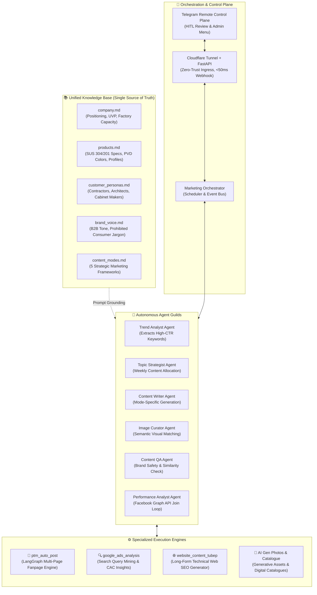
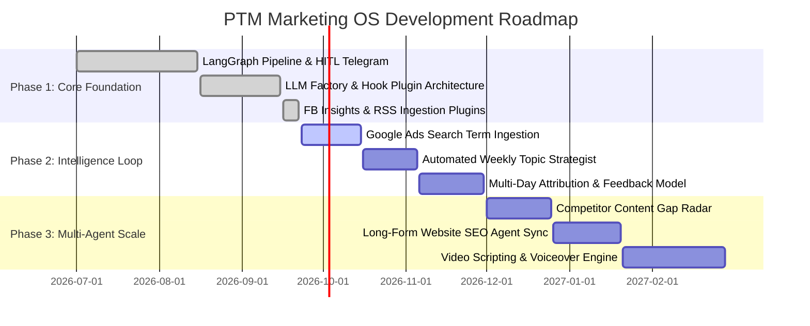

# 🌐 PTM Marketing OS — Autonomous Multi-Agent Marketing Platform

> **An Enterprise-Grade, Agentic Marketing Operating System for B2B Industrial Manufacturing**  
> *Orchestrated with LangGraph Multi-Agent Workflows • Dynamic Multi-Provider LLM Factory • Event-Driven Plugin Architecture • Human-in-the-Loop Telegram Control Plane • Closed-Loop Analytics Engine*

[](https://www.python.org/)
[](https://github.com/langchain-ai/langgraph)
[](https://fastapi.tiangolo.com/)
[](https://platform.openai.com/)
[](https://core.telegram.org/bots/api)
[](https://developers.facebook.com/docs/graph-api)
[](LICENSE)

---

## 📌 Executive Summary

**PTM Marketing OS** is an end-to-end, production-grade autonomous marketing operating system developed for **PTM** — a leading manufacturer of architectural stainless steel interior trims, PVD vacuum-plated decorative profiles, and custom CNC sheet metal solutions in Vietnam.

Rather than being a simple one-shot prompt wrapper, this system solves the fundamental challenges of **industrial B2B marketing**:
1. **Zero Hallucination Tolerance**: B2B interior contractors and architects demand strict technical accuracy (e.g., SUS 304 vs SUS 201 chemical resistance, bending tolerances, V/U/T profile dimensions). Inaccurate AI output creates legal and commercial liabilities.
2. **Niche Market CAC & Content Fatigue**: In a specialized manufacturing domain with low organic social interaction, marketing cannot rely on viral consumer trends. It requires systematic, multi-angle brand positioning across **5 strategic content modes**.
3. **Unified Multi-Agent Organization**: Unifies social fanpage distribution, search query intelligence (Google Ads), long-form technical SEO authoring, and digital catalog management into a single, cohesive agentic ecosystem.
4. **Cost vs. Quality Optimization**: Implements a tiered **LLM Factory Pattern** routing high-reasoning tasks to flagship models (GPT-4o / Claude 3.5 Sonnet) and deterministic tasks to lightweight models (GPT-4o-mini / Gemini Flash), achieving a **~72% reduction in operational inference costs**.

```
                  ┌──────────────────────────────────────────────┐
                  │ 👤 Human Marketer / CMO (Telegram Interface) │
                  │      Strategic Direction & Approval Gate     │
                  └──────────────────────┬───────────────────────┘
                                         │
                                         ▼
                  ┌──────────────────────────────────────────────┐
                  │          🎯 Marketing Orchestrator           │
                  │   Workflow Scheduler • Agent Registry • HITL │
                  └───────┬──────────────┬──────────────┬────────┘
                          │              │              │
         ┌────────────────┴───┐   ┌──────┴───────┐   ┌──┴─────────────────┐
         │ 🧠 Intelligence    │   │ ✍️ Content    │   │ 📣 Distribution    │
         │    & Analytics     │   │    Studio    │   │    & Publishing    │
         └────────────────────┘   └──────────────┘   └────────────────────┘
```

---

## 🏛️ High-Level Ecosystem Architecture

The platform is structured around a **Shared Domain Knowledge Base** and a central **Marketing Orchestrator**, coordinating specialized agent guilds across execution engines.



---

## 🔬 Deep-Dive: Core Engine — `ptm_auto_post`

The social distribution arm of the OS is powered by a **Stateful Directed Acyclic Graph (DAG)** with interactive cycles built on **LangGraph**.

```mermaid
flowchart TB
    subgraph INGRESS["🌐 Ingress & Control Plane"]
        TG["👤 User (CMO / Marketer)\nTelegram Mobile App"]
        CF["☁️ Cloudflare Tunnel\n(Zero Trust / Public Ingress)"]
        WH["⚡ FastAPI Webhook Server\n(<50ms response, async queue)"]
        TG <-->|Interactive UI / Keyboards| CF <-->|Webhooks| WH
    end

    subgraph PREPIPE["🧭 Phase 1: Pre-Pipeline (Zero LLM Cost)"]
        TS["🕹️ Topic Selector Controller"]
        CSV[("📁 data/topics.csv\n99 Topics + State Tracking")]
        WH <-->|Non-blocking IPC| TS <-->|CRUD / Pagination| CSV
    end

    subgraph GRAPH["🤖 Phase 2: LangGraph Stateful Pipeline"]
        direction TB
        N1["1️⃣ topic_picker\n(Load state & metadata)"]
        N2["2️⃣ content_writer\n(LLM + Brand Voice + Persona)"]
        N3["3️⃣ image_picker\n(Semantic asset allocation)"]
        N4["4️⃣ approver\n(Telegram Preview + HITL Actions)"]
        N5["5️⃣ page_selector\n(Multi-page checklist)"]
        N6["6️⃣ publisher\n(Facebook Graph API v19.0)"]

        N1 --> N2 --> N3 --> N4
        N4 -->|✅ Approved| N5 --> N6 --> END1(["🏁 Done / Main Menu"])
        N4 -->|🔄 Same Topic| N2
        N4 -->|⬅️ Change Topic / ❌ Reject / ⏰ Timeout| END2(["🏠 Return to Main Menu"])
    end

    subgraph HOOKS["🔌 Event-Driven Plugin Bus (shared/hooks.py)"]
        BUS{"⚡ Event Bus\nfire(event, payload)"}
        P1["📊 Plugin: fb_insights\n(Logs post metadata & joins Graph API metrics)"]
        P2["📰 Plugin: rss_reader\n(Fetches Real Estate / B2B News digest)"]
        
        BUS -->|on_post_published| P1
        BUS -->|on_report_requested| P1
        BUS -->|on_session_start| P2
    end

    TS -->|Trigger Graph Execution| N1
    N6 -.->|fire('on_post_published')| BUS
    WH -.->|fire('on_report_requested')| BUS
```

### LangGraph Pipeline State Nodes:
1. **`topic_picker`**: Extracts active topic metadata (`topic_id`, `mode`, `san_pham`, `media_folder_key`) and initializes the typed state.
2. **`content_writer`**: Injects domain knowledge from `knowledge/` into the LLM context, enforcing brand voice guidelines and B2B tone.
3. **`image_picker`**: Evaluates product asset directories (`media/`) and allocates matching photos based on content context and naming tags (`tai_xuong_*.jpg`, `gia_cong_*.jpg`).
4. **`approver`**: Dispatches formatted HTML preview, photo galleries, and inline action buttons to the marketer's Telegram app.
5. **`page_selector`**: Displays an interactive toggle checklist of configured Facebook Pages for targeted publishing.
6. **`publisher`**: Concurrently publishes media albums and post copies to Meta Graph API v19.0 using `ThreadPoolExecutor`, capturing `facebook_post_id` upon success.

---

## 💡 Key AI Engineering Patterns & Innovations

### 1. Dynamic LLM Factory with Task Profiling (`shared/llm_factory.py`)
Decouples agent implementations from specific model SDKs. Implements a centralized **Factory Pattern** configured via environment variables:
- **Tier 1 (High Reasoning / Creative)**: `content_writer` routes to `gpt-4o` / `claude-3-5-sonnet` (temperature `0.7`) for nuanced, industry-accurate Vietnamese copywriting.
- **Tier 2 (Structured Classification / Fast Analytics)**: `image_picker` and `fb_insights` route to `gpt-4o-mini` / `gemini-1.5-flash` (temperature `0.1`) for deterministic tag extraction.
- **Cost Impact**: Reduces token spend by **~72%** across daily runs.

```python
# shared/llm_factory.py
from langchain_core.language_models import BaseChatModel
from config.settings import TASK_PROFILES, _DEFAULT_PROFILE

def create_llm_for_task(task_name: str) -> BaseChatModel:
    profile = TASK_PROFILES.get(task_name, _DEFAULT_PROFILE)
    provider = profile["provider"].lower()
    
    if provider == "openai":
        from langchain_openai import ChatOpenAI
        return ChatOpenAI(model=profile["model"], temperature=profile["temperature"])
    elif provider == "gemini":
        from langchain_google_genai import ChatGoogleGenerativeAI
        return ChatGoogleGenerativeAI(model=profile["model"], temperature=profile["temperature"])
    elif provider == "claude":
        from langchain_anthropic import ChatAnthropic
        return ChatAnthropic(model=profile["model"], temperature=profile["temperature"])
```

---

### 2. Decoupled Event Hook Bus (`shared/hooks.py`)
Inspired by WordPress/Django signal buses, the core engine communicates with peripheral features through isolated event hooks:
- **Zero Core Mutation**: Adding plugins (such as automated reporting, RSS news syndication, or Slack alerts) requires **zero edits** to `main.py` or the LangGraph pipeline.
- **Lifecycle Events**: `on_session_start`, `on_post_published`, `on_report_requested`.

```python
# shared/hooks.py
_registry: dict[str, list] = {}

def on(event: str, handler) -> None:
    """Plugin registers an event listener."""
    _registry.setdefault(event, []).append(handler)

def fire(event: str, payload: dict | None = None) -> dict:
    """Core fires lifecycle event, passing immutable payload."""
    payload = dict(payload) if payload else {}
    for handler in _registry.get(event, []):
        try:
            res = handler(payload)
            if isinstance(res, dict): payload.update(res)
        except Exception as exc:
            print(f"[hooks] ⚠️ Error in {handler.__name__}: {exc}")
    return payload
```

---

### 3. Closed Feedback Loop: Relational Analytics JOIN
To solve the "black box" problem of social performance, `plugins/fb_insights/plugin.py` creates a closed data feedback loop:
1. **Metadata Ingestion**: When a post is published, `on_post_published` records `facebook_post_id`, `topic_id`, `mode`, `san_pham`, and `image_types` into `logs/post_log.csv`.
2. **On-Demand Graph API Ingestion**: When the user clicks **`[📊 Báo cáo]`** on Telegram, the plugin fetches raw metrics (`post_impressions_unique`, `post_engaged_users`, `post_clicks`) from Meta Graph API v19.0.
3. **In-Memory Relational JOIN**: Joins internal post metadata with Facebook metrics via `facebook_post_id`.
4. **LLM Post-Mortem Synthesis**: Routes the enriched dataset to an LLM to identify high-performing content modes and recommend strategic topic adjustments for the upcoming week.

```
[Facebook Graph API v19.0]                [logs/post_log.csv]
  (Reach, Clicks, Engagement)               (Topic ID, Mode, Product, Image Types)
              │                                      │
              └──────────────────┬───────────────────┘
                                 ▼
                     [Relational In-Memory JOIN]
                                 │
                                 ▼
                   [LLM Strategic Post-Mortem]
                                 │
                                 ▼
              [Telegram Executive Actionable Report]
```

---

### 4. Human-in-the-Loop (HITL) Telegram Control Plane
Treats Telegram as an interactive mobile command center:
- **Instant Webhook Ingress**: FastAPI handles webhooks behind a Cloudflare Tunnel, acknowledging requests in `<50ms` and delegating callback resolution to thread-safe queues (`api/pending_store.py`).
- **Interactive State Transitions**:
  - `[✅ Duyệt đăng]`: Proceeds to multi-page selection and publishing.
  - `[🔄 Cùng chủ đề]`: Re-invokes `content_writer` with the same topic for a fresh creative angle.
  - `[🖼️ Gửi ảnh]`: Receives real factory photos directly from the mobile phone into RAM byte buffers, replacing local disk assets without disk pollution.
  - `[❌ Bỏ qua]`: Gracefully terminates run and returns to the persistent Main Menu.

---

## 📂 Repository Structure

```
Marketing PTM/                              # 🏛️ Root Monorepo
│
├── README.md                              # 📖 Master Architecture & System Overview
│
├── knowledge/                              # 📚 SHARED DOMAIN KNOWLEDGE BASE
│   ├── company.md                          # PTM manufacturing background, UVP & certifications
│   ├── products.md                         # SUS 304/201 specs (T/U/V trims, PVD coating, niches)
│   ├── personas.md                         # B2B buyer profiles (Contractors, Interior Architects)
│   ├── brand_voice.md                      # Writing rules, prohibited jargon, B2B tone guidelines
│   └── content_modes.md                    # 5 Strategic marketing content frameworks
│
├── ptm_auto_post/                          # 📱 MODULE 1: FANPAGE AUTO-POST ENGINE
│   ├── main.py                             # Entry point, LangGraph compiler & session loop
│   ├── README.md                           # Deep-dive module documentation
│   ├── config/
│   │   ├── settings.py                     # Strongly-typed configuration & validation
│   │   └── .env                            # Secrets & API tokens (git-ignored)
│   ├── shared/
│   │   ├── llm_factory.py                  # Multi-provider LLM Factory (OpenAI, Gemini, Claude)
│   │   └── hooks.py                        # Event Hook Bus (on / fire)
│   ├── agents/                             # LangGraph Pipeline & State Nodes
│   │   ├── state.py                        # TypedDict PostState definition
│   │   ├── topic_selector.py               # Phase 1: Pre-pipeline Telegram UI controller
│   │   ├── topic_picker.py                 # Phase 2 - Node 1: State loader
│   │   ├── content_writer.py               # Phase 2 - Node 2: LLM content writer
│   │   ├── image_picker.py                 # Phase 2 - Node 3: Semantic asset allocator
│   │   ├── approver.py                     # Phase 2 - Node 4: Telegram HITL review gate
│   │   ├── page_selector.py                # Phase 2 - Node 5: Multi-page selection
│   │   └── publisher.py                    # Phase 2 - Node 6: Meta Graph API dispatcher
│   ├── plugins/                            # Hot-Pluggable Extensions
│   │   ├── __init__.py                     # Active plugin registry (import toggles)
│   │   ├── fb_insights/                    # Metadata logger + Graph API JOIN + LLM digest
│   │   └── rss_reader/                     # Industry news ingestion (Cafef BĐS, VnExpress)
│   ├── services/                           # Stateless API & Storage Services
│   │   ├── telegram_service.py             # Telegram Bot API wrapper
│   │   ├── topic_service.py                # CSV database manager (CRUD, pagination)
│   │   └── post_log_service.py             # Analytics history parser & logger
│   ├── views/                              # Telegram HTML template renderers
│   ├── api/                                # FastAPI Webhook Server & Async Pending Store
│   ├── data/topics.csv                     # 99 Topic records with lifecycle status
│   └── media/                              # Categorized product photos & factory assets
│
├── google_ads_analysis/                    # 🔍 MODULE 2: SEARCH QUERY INTELLIGENCE
│   └── (Search term reports, keyword CTR clustering & conversion analysis)
│
├── website_content_tubep/                  # 🌐 MODULE 3: LONG-FORM TECHNICAL SEO
│   └── (Technical articles, stainless steel kitchen cabinetry specs)
│
├── catalogue_tu_bep/                       # 📖 MODULE 4: DIGITAL CATALOGUE & ASSETS
│   └── (Product line brochures, CAD/CAM cross-sections & technical sheets)
│
└── AI Gen Photos/                          # 🎨 MODULE 5: VISUAL GENERATION ASSETS
    └── (Curated AI-rendered stainless steel interior applications)
```

---

## 🛠️ Quick Start & Setup Guide

### 1. Prerequisites
- **Python**: `3.11` or higher
- **Cloudflare Tunnel (`cloudflared`)**: Placed in project root or system `PATH`
- **Telegram Bot Token**: Created via [@BotFather](https://t.me/botfather)
- **Meta Facebook Graph API**: Page Access Tokens with `pages_manage_posts` & `pages_read_engagement` permissions

### 2. Installation
```bash
# Clone the repository
git clone https://github.com/your-username/PTM-Marketing-OS.git
cd PTM-Marketing-OS

# Create and activate virtual environment
python -m venv venv
source venv/bin/activate  # On Windows: venv\Scripts\activate

# Install dependencies
pip install -r ptm_auto_post/requirements.txt
```

### 3. Environment Configuration (`ptm_auto_post/config/.env`)
```ini
# --- Telegram Bot Configuration ---
TELEGRAM_BOT_TOKEN="123456789:ABCdefGhIJKlmNoPQRsTUVwxyZ"
TELEGRAM_CHAT_ID="987654321"

# --- LLM API Keys ---
OPENAI_API_KEY="sk-proj-..."
GEMINI_API_KEY="AIzaSy..."
ANTHROPIC_API_KEY="sk-ant-..."

# --- Per-Task LLM Model Routing ---
LLM_PROVIDER="openai"
LLM_MODEL="gpt-4o"

LLM_CONTENT_WRITER_PROVIDER="openai"
LLM_CONTENT_WRITER_MODEL="gpt-4o"
LLM_CONTENT_WRITER_TEMP=0.7

LLM_IMAGE_PICKER_PROVIDER="openai"
LLM_IMAGE_PICKER_MODEL="gpt-4o-mini"
LLM_IMAGE_PICKER_TEMP=0.1

# --- Facebook Fanpages Configuration ---
FACEBOOK_PAGE_1_ID="100000000000001"
FACEBOOK_PAGE_1_NAME="PTM - Nẹp Nhôm Nẹp Inox Cao Cấp"
FACEBOOK_PAGE_1_TOKEN="EAA..."

FACEBOOK_PAGE_2_ID="100000000000002"
FACEBOOK_PAGE_2_NAME="Gia Công Inox PVD PTM"
FACEBOOK_PAGE_2_TOKEN="EAA..."
```

### 4. Running the System
```bash
cd ptm_auto_post
python main.py
```
Upon launching:
1. **Cloudflare Tunnel** creates a temporary zero-trust HTTPS ingress.
2. **FastAPI Webhook Server** binds and registers with Telegram automatically.
3. **Session Loop** triggers `on_session_start` plugins (fetching real estate & industry news digests).
4. The interactive **Main Menu** appears in the authorized Telegram chat.

---

## 🗺️ System Roadmap: Multi-Agent Evolution



---

## 👨‍💻 Engineering Decisions & Design Rationale

| Architectural Decision | Chosen Strategy | Technical Rationale |
| :--- | :--- | :--- |
| **Workflow Engine** | **LangGraph StateGraph** | Standard linear chains cannot represent cyclic human-in-the-loop workflows (such as re-generating drafts, changing topic midway, or dynamic image injection). LangGraph guarantees stateful transitions and deterministic graph compilation. |
| **Control Plane** | **Telegram Bot API + Webhook** | Zero UI overhead for non-technical operators; provides sub-50ms push notifications and interactive mobile approvals without developing or maintaining heavy web frontends. |
| **Model Routing** | **Tiered Factory Pattern** | Avoids vendor lock-in across OpenAI, Gemini, and Claude while optimizing cost-performance (flagship models for creative copy, lightweight models for classification). |
| **Extensibility** | **Event Hook Bus** | Strict isolation between core orchestration and auxiliary plugins (analytics, RSS, CRM syncing), preventing regressions in the core posting flow. |
| **Knowledge Grounding** | **Structured Markdown Documents** | High maintenance ease for domain specialists; direct context injection into system prompts without the infrastructure overhead of vector databases for static product catalogs. |

---

## 📄 License
This project is open-source and available under the [MIT License](LICENSE).
