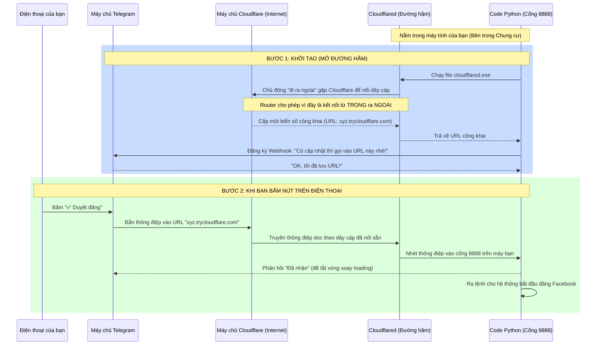

# Bản chất luồng dữ liệu: Máy tính, Internet và Telegram

Để hiểu đúng bản chất hệ thống mà không cần nền tảng kỹ thuật phức tạp, chúng ta hãy đi từ **quy luật cơ bản của mạng Internet** đến cách hệ thống của bạn hoạt động.

---

## 1. Vấn đề gốc rễ: Tại sao Telegram không thể kết nối trực tiếp vào máy bạn?

Hãy tưởng tượng mạng Internet là một **thành phố**, còn mạng Wi-Fi nhà bạn là một **tòa chung cư**.

- **Máy chủ Telegram, Facebook, Google:** Là những tòa nhà có **mặt tiền** và **địa chỉ công khai** (Public IP). Bất kỳ ai trên thế giới cũng có thể gọi taxi đến đúng địa chỉ đó.
- **Máy tính của bạn:** Giống như một **căn hộ (phòng 301)** nằm bên trong tòa chung cư. Máy tính của bạn chỉ có **địa chỉ nội bộ** (Local IP, ví dụ `192.168.1.5`). 
- **Cục phát Wi-Fi (Router):** Đóng vai trò là **bảo vệ và lễ tân** của tòa chung cư. 

**Quy luật bảo mật của Router:** 
- Bạn (từ bên trong) có thể thoải mái gọi điện hoặc đi ra ngoài (truy cập web).
- Nhưng **bảo vệ sẽ chặn đứng mọi người lạ từ bên ngoài** muốn tự ý xông vào phòng bạn (để chống hacker).

👉 **Đó là lý do:** Dù máy tính của bạn đang mở, Telegram (người lạ ở ngoài) **không có cách nào** chủ động gõ cửa máy tính của bạn để báo "Có người vừa bấm nút Duyệt kìa!".

---

## 2. Đường hầm Cloudflare (Cloudflared) hoạt động ra sao?

Để giải quyết vấn đề trên mà không cần tắt bảo vệ của Router, chúng ta dùng kỹ thuật gọi là **Đường hầm ngược (Reverse Tunnel)** thông qua Cloudflare.

### Giải thích chi tiết theo sơ đồ:

**Ở Bước 1 (Khi bạn gõ lệnh `python main.py`):**
1. Code Python của bạn sẽ đánh thức `cloudflared.exe`.
2. `cloudflared.exe` chủ động **kéo một đường cáp ngầm** từ máy bạn nối tới trung tâm dữ liệu của hãng Cloudflare (Mỹ/Singapore). Vì nó chủ động đi từ *trong ra ngoài*, nên cục Wi-Fi nhà bạn không chặn.
3. Cloudflare cấp cho đầu cáp bên kia một **địa chỉ mặt tiền** (ví dụ: `xyz.trycloudflare.com`).
4. Code Python của bạn sẽ nhắn tin cho Telegram: *"Này Telegram, từ giờ có ai chat với bot thì hãy gửi dữ liệu thẳng vào địa chỉ mặt tiền `xyz.trycloudflare.com` nhé"*. 

**Ở Bước 2 (Khi hệ thống hoạt động):**
1. Bạn cầm điện thoại lướt Telegram và bấm vào nút **"Duyệt đăng"**.
2. Máy chủ Telegram nhận được thao tác của bạn. Nhớ lời dặn dò ban nãy, nó lập tức đóng gói thông tin và gửi chuyển phát nhanh đến địa chỉ `xyz.trycloudflare.com`.
3. Máy chủ Cloudflare đứng ở địa chỉ đó nhận được gói hàng. Nó thấy đường dây cáp ngầm nối thẳng về máy tính của bạn đang mở. Nó thả gói hàng trôi dọc theo ống hầm.
4. Gói hàng chui tọt vào máy tính của bạn và rơi đúng vào phần mềm Python (đang há miệng chờ sẵn ở cổng số `8888`).
5. Code Python ngay lập tức nhận lệnh, tắt vòng quay loading trên màn hình Telegram của bạn, và tự động gọi API Facebook để đăng bài.

**Toàn bộ quá trình Bước 2 này diễn ra trong chưa tới 1/10 giây (0.1 giây), bằng tốc độ ánh sáng truyền trong cáp quang.**

---

## 4. Góc nhìn Kỹ thuật (Networking Deep Dive)
*Phần này dành để bạn học các thuật ngữ mạng máy tính thực thụ, đối chiếu với ví dụ đời thường ở trên.*

### A. IP Public, IP Private và NAT
- **IP Private (Địa chỉ nội bộ):** Máy tính của bạn được Router (Modem Wi-Fi) cấp một địa chỉ cục bộ (vd: `192.168.1.5`). Dải IP này chỉ có ý nghĩa trong mạng LAN ở nhà bạn. Người trên Internet không thể "nhìn thấy" IP này.
- **IP Public (Địa chỉ công khai):** Là IP mà nhà mạng (VNPT, FPT) cấp cho cục Router của bạn (vd: `14.238.x.x`). Đây là IP duy nhất đại diện cho cả mạng nhà bạn trên bản đồ Internet.
- **NAT (Network Address Translation):** Tính năng của Router. Khi máy bạn duyệt web, Router nhận gói tin từ IP Private, "đóng mác" lại thành IP Public rồi gửi ra ngoài. Khi web trả lời, Router nhớ gói tin đó thuộc về máy nào và chuyển ngược lại vào trong.
- **Vấn đề Inbound Connection:** NAT chặn mọi kết nối chủ động **đi từ ngoài vào trong (Inbound)**. Nếu Telegram cố gửi dữ liệu tới IP Public của nhà bạn, Router sẽ ném bỏ (Drop) vì nó không biết phải chuyển cho máy tính hay điện thoại nào bên trong, và cũng để chống Hacker quét cổng mạng.

### B. Polling vs Webhook
- **Long-polling (Cách cũ):** Hệ thống của bạn chủ động mở kết nối từ trong ra ngoài (Outbound) tới máy chủ Telegram (API `getUpdates`). Quá trình này liên tục tạo ra các **TCP Connection**, giữ kết nối mở trong 30 giây. Rất tốn tài nguyên (CPU, RAM, Băng thông).
- **Webhook (Cách mới - Event-Driven):** Bạn cung cấp một URL công khai. Bất cứ khi nào có sự kiện (bấm nút), Telegram sẽ tự động tạo một giao thức **HTTP POST request** mang theo dữ liệu (chuỗi JSON) và đẩy (Push) thẳng vào URL đó. Hệ thống không cần hỏi vòng lặp nữa. Đỉnh cao của sự tối ưu tài nguyên.

### C. Reverse Proxy & Tunneling (Bản chất của Cloudflared)
Làm sao để giải bài toán: *Webhook yêu cầu địa chỉ công khai, mà máy bạn thì kẹt đằng sau NAT?*
- **Reverse Proxy (Proxy ngược):** Server Cloudflare đóng vai trò là lớp mặt tiền. Khách hàng (Telegram) gửi request cho Cloudflare, Cloudflare sẽ chuyển tiếp (Forward) request đó về server thực sự (Máy tính của bạn).
- **Tunneling (Đường hầm TCP/UDP):** File `cloudflared.exe` trên máy bạn **chủ động tạo một kết nối Outbound (từ trong ra ngoài)** tới server Cloudflare. Vì nó xuất phát từ bên trong, NAT cho phép kết nối này. 
- Thay vì đóng kết nối, `cloudflared` giữ nguyên kênh truyền này dưới dạng **WebSocket** hoặc **QUIC (UDP)** multiplexing. 
- Khi Cloudflare nhận được HTTP POST từ Telegram, nó "nhồi" gói tin đó vào đường hầm đã mở sẵn. Gói tin đi ngược chiều về máy tính bạn, thoát qua NAT một cách hợp lệ.

### D. Port (Cổng giao tiếp)
- Khi dữ liệu đã vượt qua được Router để vào máy tính của bạn, nó cần biết phải đi vào ứng dụng nào (bạn đang bật cả Chrome, Zalo, Telegram...).
- Máy tính có 65.535 Cổng (Ports). Ta cấu hình FastAPI chạy ở **Port 8888** (`localhost:8888`).
- `cloudflared` sau khi nhận gói tin từ đường hầm sẽ giải nén và chuyển tiếp (Forward) chính xác vào Cổng 8888 trên cạc mạng ảo vòng lặp (`127.0.0.1` - localhost). Nhờ vậy, code Python nhận được dữ liệu hoàn hảo.

---

## 5. Bản chất của Kiến trúc Hệ thống 

Những gì tôi vừa setup cho bạn chính là một kiến trúc chuẩn mực (Microservices / Event-Driven) mà các tập đoàn công nghệ lớn đang dùng. 

- **Code Python của bạn** hiện đóng vai trò là một **Máy chủ Backend (Web Server)**. Nó chạy bằng công nghệ `FastAPI` (công nghệ tạo Web API nhanh nhất hiện nay bằng Python).
- Thay vì bạn phải bỏ vài trăm ngàn mỗi tháng để thuê một con máy chủ (VPS) trên mạng để chạy code này, **bạn đang biến chính Laptop/PC của mình thành một máy chủ toàn cầu**. Ai trên thế giới có link cũng truy cập được vào code của bạn.

Việc hiểu luồng dữ liệu này giúp bạn thấy rõ: **Dữ liệu không bao giờ nằm chết ở một nơi, nó liên tục chảy xuyên qua các bức tường lửa nhờ những "đường hầm" do chính chúng ta đào.**
